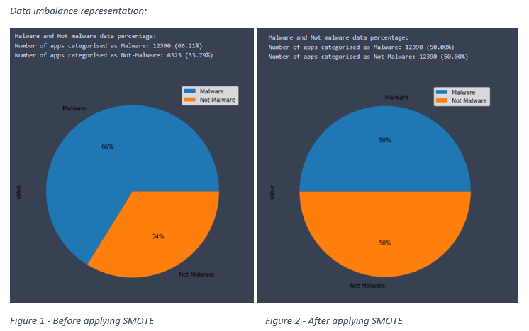
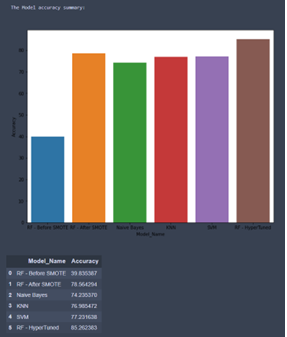

# Imbalance-Handling(using SMOTE)-and-Imgae-Classification

**Introduction**

In our digitalized age, mobile phones have become a necessity, with Android mobile phones accounting for the bulk of users. Mobile applications(apps) have simplified many parts of life, including entertainment, health tracking, and many more. With the benefits come the drawbacks; malicious and fraudulent apps are on the rise. In its latest newsletter Google has announced 1.2 million apps have been blocked by the firm, due to the applications harmful activities.

These considerations fuelled the development of machine learning methods for determining whether an app is harmful or not, which is the study's goal.

For this project, a dataset with permission details for many applications was used, and several pre-processing steps were performed, including data imbalance handling, categorical variable handling, and the different machine learning models for classifying the apps were developed.

Evaluating the models, the hyper parameter tuned Random Forest performed the best out of five different machine learning models, with an overall accuracy of 85.26 percent.

**Steps**

**Data Preprocessing**

> Handling Null values

> Variable selection

> Feature scaling

> One-hot encoding (Categorical variable handling)

**Classification Models**

> Random forest

> Naïve Bayes

> Support vector machines - SVM

> K-Nearest Neighbours -KNN

**Imbalance Handling - SMOTE**

An unbalanced dataset is one in which distinct classes are not equally represented. For example, in a binary situation, one class has a much higher number of datapoints than the other.
There are several techniques to handle data imbalance, Over and under sampling which increases and decreases the total number of records based on different methods, cost sensitive learning, combined class method which fused multiple methods together to obtain optimum solutions etc.
The problem with imbalanced dataset, when employing an imbalanced dataset for classification, the model becomes biased towards the dominant class. If the dataset is imbalanced, with 90% in the majority and 10% in the minority, the model will tend to forecast all or most observations as the majority class only when applied to new datasets. 

There are two types of classes in the Android permission dataset: malware and not malware. Malware apps account for 66% of the total datapoints, while not malware accounts for 34%. In this case, there exists a 1:2 class imbalance.
To handle the imbalance SMOTE- Synthetic Minority Over-sampling Technique was used, SMOTE is a data augmentation algorithm that creates synthetic data points depending on the original data points. SMOTE does not duplicate the original datapoints, rather it creates new synthetic data elements which are similar to the existing datapoints but slightly different. The SMOTE technique calculates possible nearest values of a minority class, multiply the values with random values between 0 and 1 and generate new set of datapoints in the data frame.

In general a random oversampling might increase the over fitting likelihood, in terms of SMOTE since the data are not copied, it will not result in duplicate datasets, further since the synthetic data generated are based on the existing dataset it will still hold the similarity with the existing datapoints.
Previous research on evaluation of SMOTE have shown significant improvement in model efficiency. The performance analysis of SMOTE based technique concludes that SMOTE provides significant improvement and further suggests improved variants of SMOTE to be considered to compare imbalance handling.

**Results**

**Imbalance handling and impact on results

The SMOTE technique was applied to handle the imbalance in the dataset by oversampling the minority class. The random forest model which was identified to be the best fit classifier was trained on the dataset before and after applying SMOTE. The following are the outcomes produced 

Malware apps account for 66% of the total datapoints, while not malware accounts for 34%, where 1 represents Malware and 0 represents not malware (Step 5.1 in code).
First, the model's accuracy on the validation dataset is 39.8 and 78.56 before and after applying SMOTE, respectively, as shown in Figure 6. The true positive and false positive values are provided by the confusion matrix of the findings, which can be seen in the first image. All of the true positive values have been misclassified as 1 instead of 0, this means that the model predicts with a 0% precision on the minority class. Thus, the model is completely biased towards the majority class 1, and classifies all apps as malware. 
The next image in the figure gives the confusion matrix of the model which was trained after the dataset was balanced. In this case the datapoints were equally split at 50% for each class. In this case the model provides 79% accuracy.

**Model Evaluations

A total of 6 classification models were developed which includes initial model before imbalance handling, 4 baseline models and 1 hyper parameter tuned for the best fit baseline model.
The Figure below provides the accuracy metric and represents the same graphically in a bar plot. Over all Random Forest is the best performing model with 85.26 % accuracy.

All other classification techniques developed namely, Naïve bayes, KNN and SVM perform with a validation accuracy of 74.2, 76.9 and 77.2% respectively.

